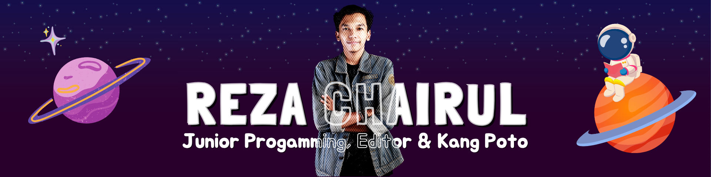

### Hello, I'am Reza Chairul 👋

##### About Me
🎓 Mahasiswa Teknik Informatika di [ITERA](https://www.itera.ac.id)
📍 Tinggal di Lampung, Indonesia
💻 Fokus: WebGIS, Laravel, React, PostgreSQL, Tailwind CSS
🗺️ Saat ini sedang eksplorasi visualisasi dan manajemen data geospasial
🎨 Hobi: Desain grafis, fotografi dan editing
🚀 Suka memecahkan masalah & membangun solusi interaktif

> Mari terhubung dan bangun sesuatu yang luar biasa bersama!
---

##### 🛠️ Skill's
Saya memiliki pengalaman dalam pemrograman web, khususnya di bidang WebGIS, serta keterampilan dalam desain visual dan pengolahan media. Berikut adalah beberapa tools dan teknologi yang saya gunakan:

###### 👨‍💻 Programming & Tools

  
  
  
  
  
  
  
  
  
  
  
  
  

###### 🎨 Design & Media Editing

  
  
  
  

---

##### 🎮 Play Game With Me

<picture>
  <source media="(prefers-color-scheme: dark)" srcset="https://raw.githubusercontent.com/rezachairul/rezachairul/output/pacman-contribution-graph-dark.svg">
  <source media="(prefers-color-scheme: light)" srcset="https://raw.githubusercontent.com/rezachairul/rezachairul/output/pacman-contribution-graph.svg">
  
</picture>

<!--  -->

---

##### 📊 My GitHub Stats

<table border="0">
  <tr>
    <td>
      
    </td>
    <td>
      
    </td>
  </tr>
</table>

---

##### 🎵 Now Playing on Spotify
Lagi dengerin musik sambil ngoding 🎧
🎶 Favorite Song Right Now:
**ONE OK ROCK — “Tropical Therapy”** 🌴🎸

---

#### 💬 *Quote of the Day*
> **"Ngoding itu bukan cuma soal nyusun baris kode buat nyuruh komputer kerja,  
> tapi juga soal melatih kesabaran, membangun konsistensi,  
> dan menempa ketekunan yang pelan-pelan bakal ngasah karakter kita."**  
> — *Reza Chairul*

---

##### 🌐 Connect With Me

  
  
  

---

  &copy; 2025 <a href="https://github.com/rezachairul" target="_blank">rezachairul</a>. All rights reserved. 

